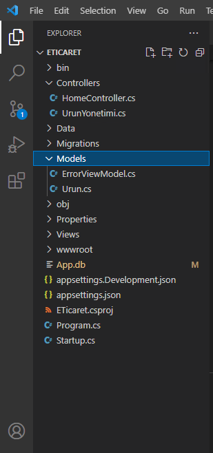
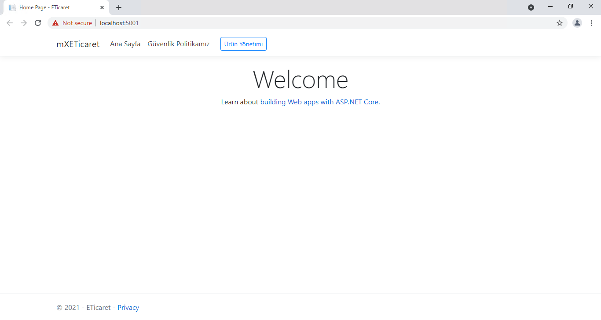
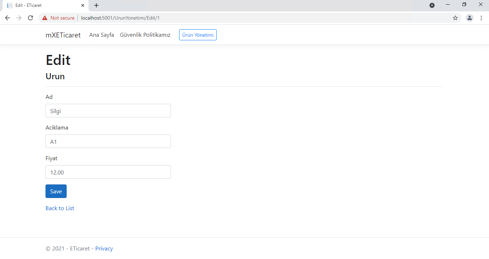
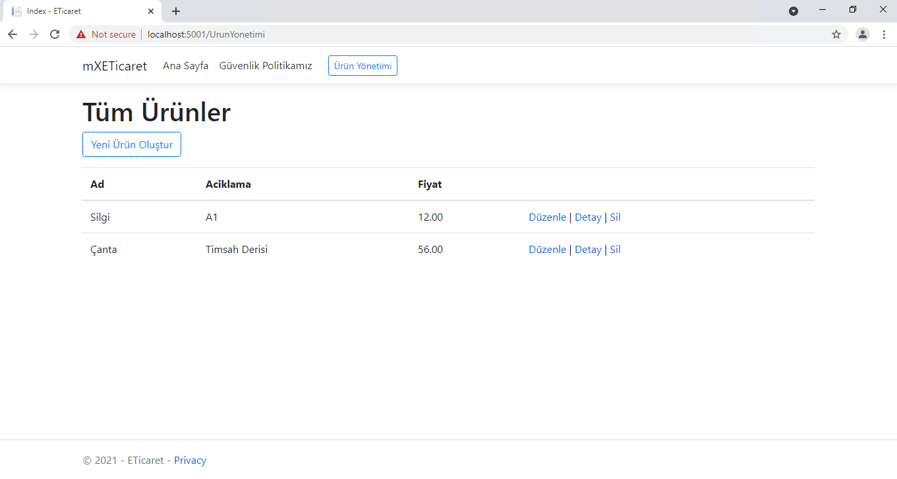
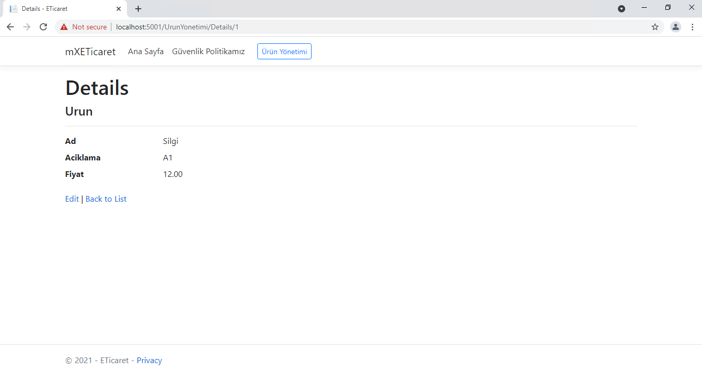
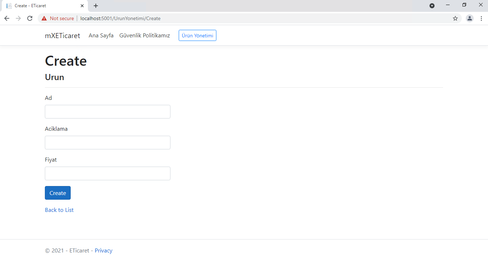

<h2>MX E-Ticaret</h2>
 

</img>

<h2>File Directory</h2>
<ul>
    <li><b>Main</b></li>
        <ul>
            <li><a href='https://github.com/mXBozkurt/ETicaret/blob/master/Program.cs'> Program.cs </a></li>
        </ul>
    <li><b>Controllers</b></li>
        <ul>
            <li>Home</li>
                <ul>
                    <li><a href="https://github.com/mXBozkurt/ETicaret/tree/master/Controllers/HomeController.cs">HomeController.cs</a></li>
                </ul>
            <li>Ürün Yönetimi</li>
                <ul>
                    <li><a href="https://github.com/mXBozkurt/ETicaret/tree/master/Controllers/UrunYonetimi.cs">UrunYonetimi.cs</a></li>
                </ul>
        </ul>
    <li><b>Data Access</b></li>
        <ul>
            <li>DataContext</li>
                <ul>
                    <li><a href="https://github.com/mXBozkurt/ETicaret/tree/master/Data/ETicaretContext.cs">ETicaretContext.cs</a></li>
                </ul>
        </ul>
    <li><b>Views</b></li>
                <ul>
                    <li><a href="https://github.com/mXBozkurt/ETicaret/tree/master/Views">Views</a></li>
                </ul>
    

     
    

        
Project Code Design...

        </img>
    

    

     
    

      
Project Detail Photos Web...

        </img>
        </img>  
        </img>
        </img>
        </img>
    

    
    
    
<ul>
